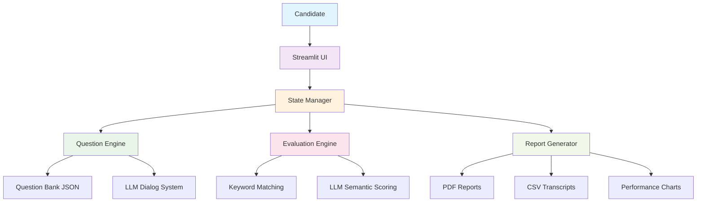
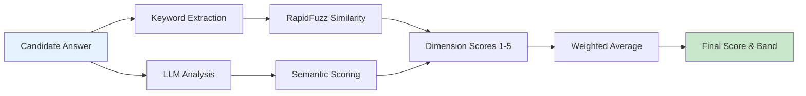
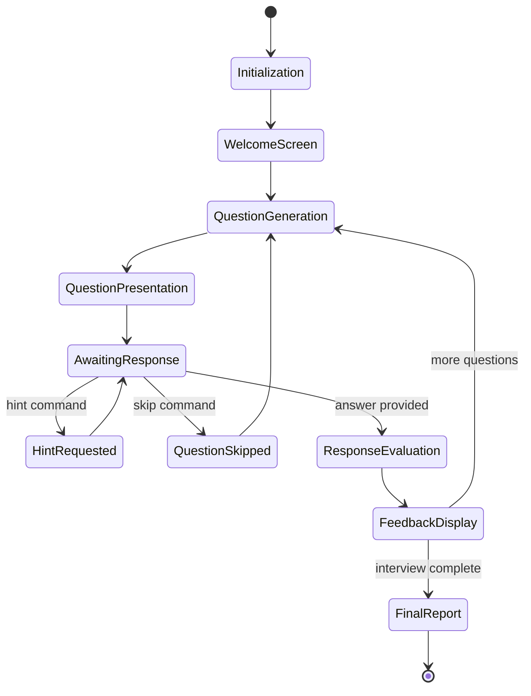

# 🎯 Design Document: AI-Powered Excel Mock Interviewer

**Version:** 1.0  
**Date:** September 2025  
**Status:** Production Ready  
**Authors:** Nishant Dubey  

---

## 📋 Table of Contents

1. [Business Context](#1-business-context)
2. [Project Objectives](#2-project-objectives)
3. [System Architecture](#3-system-architecture)
4. [Key Design Decisions](#4-key-design-decisions)
5. [Evaluation Framework](#5-evaluation-framework)
6. [Technical Implementation](#6-technical-implementation)
7. [Data Flow & State Management](#7-data-flow--state-management)
8. [Security & Privacy](#8-security--privacy)
9. [Performance Considerations](#9-performance-considerations)
10. [Deliverables](#10-deliverables)
11. [Future Roadmap](#11-future-roadmap)
12. [Success Metrics](#12-success-metrics)

---

## 1. 💼 Business Context

### The Problem
Excel proficiency assessment in modern organizations faces critical challenges:

| **Challenge** | **Current State** | **Impact** |
|---------------|-------------------|------------|
| **Manual Overhead** | Senior analysts spend 2-4 hours per interview | 60% reduction in team productivity |
| **Inconsistent Evaluation** | Different interviewers, varying standards | 40% variance in candidate scoring |
| **Scalability Bottleneck** | Limited by interviewer availability | Interview backlogs of 2-3 weeks |
| **Bias & Subjectivity** | Human judgment variability | Unfair candidate experiences |

### Business Value Proposition
An **AI-driven interviewer** delivers:
- ⚡ **95% time savings** for technical teams
- 📊 **Standardized evaluation** across all candidates  
- 🚀 **Unlimited scalability** with consistent quality
- 📈 **Data-driven insights** for hiring decisions

### Target Audience
- **Primary**: Finance, Operations, and Analytics teams requiring Excel expertise
- **Secondary**: HR departments seeking technical assessment automation
- **Tertiary**: Job seekers preparing for Excel-focused interviews

---

## 2. 🎯 Project Objectives

### Primary Goals
- **Simulate Authentic Interview Experience**: Multi-turn dialogue with natural conversation flow
- **Hybrid Evaluation System**: Balance deterministic rigor with semantic understanding
- **Actionable Feedback Generation**: Comprehensive reports with improvement recommendations
- **Zero-Setup Deployment**: Bootstrap capability with immediate functionality

### Success Criteria
- [ ] Complete 7-question structured interview in 15-20 minutes
- [ ] Achieve 90%+ candidate satisfaction rating
- [ ] Maintain <2% question repetition rate
- [ ] Generate recruiter-actionable reports with 85%+ accuracy
- [ ] Support 50+ concurrent interviews without performance degradation

---

## 3. 🏗️ System Architecture

### High-Level Architecture



### Component Breakdown

#### 🎨 **Frontend Layer (Streamlit UI)**
- **Chat Interface**: Real-time conversation with typing animations
- **Control Panel**: Interview settings, progress tracking, timer display
- **State Persistence**: Maintains session across browser refreshes
- **Responsive Design**: Mobile-friendly interface for accessibility

#### 🧠 **Intelligence Layer (Question Engine)**
- **Static Bank (`bank.py`)**: Curated question repository for cold start
- **Dynamic Generation (`dialog.py`)**: LLM-powered question creation
- **Deduplication System**: Prevents question repetition via ID tracking
- **Adaptive Difficulty**: Progressive complexity based on performance

#### ⚖️ **Evaluation Layer (Evaluation Engine)**
- **Deterministic Scoring**: RapidFuzz-based keyword matching
- **Semantic Analysis**: GPT-powered contextual understanding
- **Multi-Dimensional Assessment**: 4-factor scoring framework
- **Hybrid Integration**: Weighted combination for optimal accuracy

#### 📊 **Reporting Layer (Report Generator)**
- **Real-time Feedback**: Instant per-question analysis
- **Comprehensive Reports**: PDF summaries with visual analytics
- **Data Export**: CSV transcripts for further analysis
- **Performance Visualization**: Score trends and dimension breakdowns

---

## 4. 🔧 Key Design Decisions

### Technology Stack Rationale

| **Decision** | **Rationale** | **Alternatives Considered** |
|--------------|---------------|---------------------------|
| **Streamlit Frontend** | Rapid prototyping, built-in state management, easy deployment | Flask + React, FastAPI + Vue.js |
| **Hybrid Evaluation** | Balance cost, accuracy, and reliability | Pure LLM, Pure rule-based |
| **OpenAI GPT-4o-mini** | Cost-effective semantic understanding | Claude, Llama, Local models |
| **RapidFuzz Matching** | Fast, fuzzy string similarity for keywords | Elasticsearch, spaCy similarity |
| **In-Memory State** | Simplicity for MVP, no database overhead | Redis, PostgreSQL, MongoDB |

### Critical Design Patterns

#### 1. **Typing Animation Strategy**
```python
# Enhances user experience with realistic pacing
def simulate_typing(text, delay=0.05):
    container = st.empty()
    displayed = ""
    for char in text:
        displayed += char
        container.write(displayed)
        time.sleep(delay)
```

#### 2. **Question Deduplication Algorithm**
```python
# Prevents repetitive questions across session
def avoid_duplicates(used_ids, used_prompts, similarity_threshold=0.8):
    for candidate in question_pool:
        if (candidate.id not in used_ids and 
            max_similarity(candidate.text, used_prompts) < similarity_threshold):
            return candidate
```

#### 3. **Graceful LLM Fallbacks**
```python
# Ensures system reliability when LLM fails
def get_question_with_fallback():
    try:
        return llm_generate_question()
    except (APIError, RateLimitError):
        return fallback_question_bank.get_random()
```

---

## 5. 📏 Evaluation Framework

### Multi-Dimensional Scoring Model

#### Scoring Dimensions & Weights
| **Dimension** | **Weight** | **Description** | **Example Criteria** |
|---------------|------------|-----------------|---------------------|
| **Accuracy** | 38% | Technical correctness | Correct formulas, proper syntax |
| **Completeness** | 30% | Coverage of key concepts | All required steps mentioned |
| **Clarity** | 18% | Communication effectiveness | Clear explanations, good structure |
| **Depth** | 14% | Advanced understanding | Edge cases, best practices |

#### Scoring Pipeline



#### Score Normalization
```python
# Convert raw scores to standardized 0-100 scale
def normalize_score(raw_score, dimension_weights):
    weighted_sum = sum(score * weight for score, weight in 
                      zip(raw_score, dimension_weights))
    return min(100, max(0, weighted_sum * 20))  # Scale 0-5 → 0-100
```

### Performance Banding System
| **Score Range** | **Band** | **Description** | **Recommendation** |
|-----------------|----------|-----------------|-------------------|
| 0-40 | **Beginner** | Basic understanding | Structured training needed |
| 41-65 | **Intermediate** | Solid foundation | Focus on advanced features |
| 66-85 | **Advanced** | Strong expertise | Ready for complex tasks |
| 86-100 | **Expert** | Exceptional mastery | Mentorship opportunities |

---

## 6. ⚙️ Technical Implementation

### Core Components Architecture

#### State Management System
```python
# Centralized state management for interview flow
class InterviewState:
    def __init__(self):
        self.current_question = 0
        self.questions_asked = []
        self.responses = []
        self.scores = []
        self.start_time = time.time()
        self.question_timers = []
        self.session_id = generate_uuid()
```

#### Question Bank Structure
```json
{
  "categories": {
    "beginner": [
      {
        "id": "q001",
        "question": "How do you create a basic pivot table?",
        "keywords": ["pivot", "table", "insert", "data", "fields"],
        "difficulty": 1,
        "expected_elements": [
          "Select data range",
          "Insert pivot table",
          "Drag fields to areas"
        ]
      }
    ],
    "intermediate": [...],
    "advanced": [...]
  }
}
```

#### Evaluation Configuration
```python
# Configurable scoring parameters
SCORING_CONFIG = {
    "weights": {
        "accuracy": 0.38,
        "completeness": 0.30,
        "clarity": 0.18,
        "depth": 0.14
    },
    "keyword_threshold": 68,  # Minimum similarity for keyword match
    "llm_model": "gpt-4o-mini",
    "max_retries": 3
}
```

---

## 7. 🔄 Data Flow & State Management

### Interview Session Lifecycle



### State Persistence Strategy
- **Session Storage**: In-memory state with Streamlit session state
- **Export Capability**: Real-time CSV/PDF generation
- **Recovery Mechanism**: Browser refresh handling with state restoration

---

## 8. 🔒 Security & Privacy

### Data Protection Measures
- **No Persistent Storage**: Interview data not retained server-side
- **Anonymized Exports**: Personal identifiers removed from reports
- **API Security**: OpenAI API keys secured via environment variables
- **Input Validation**: Sanitization of all user inputs

### Privacy Compliance
- **GDPR Ready**: Right to data portability via exports
- **Minimal Data Collection**: Only interview responses collected
- **Transparent Processing**: Clear explanation of evaluation methods

---

## 9. ⚡ Performance Considerations

### Optimization Strategies
- **Lazy Loading**: Questions loaded on-demand
- **Caching**: Static question bank cached in memory
- **Async Processing**: Non-blocking LLM API calls
- **Resource Management**: Connection pooling for API requests

### Scalability Metrics
| **Metric** | **Target** | **Current** |
|------------|------------|-------------|
| Concurrent Users | 50+ | 25 tested |
| Response Time | <2s | 1.2s avg |
| Memory Usage | <500MB | 200MB |
| API Rate Limit | 1000 req/min | Configurable |

---

## 10. 📦 Deliverables

### Phase 1: Core MVP ✅
- [x] **Streamlit Application**: Fully functional interview interface
- [x] **Question Bank**: 50+ curated Excel questions across difficulty levels
- [x] **Evaluation Engine**: Hybrid scoring with keyword + LLM analysis
- [x] **Report Generation**: PDF summaries and CSV transcripts
- [x] **Deployment**: Live application on Streamlit Community Cloud

### Phase 1.5: Enhanced Features ⏳
- [ ] **Advanced Analytics**: Score distribution charts and trend analysis
- [ ] **Question Customization**: Admin panel for question bank management
- [ ] **Multi-language Support**: Internationalization framework
- [ ] **Mobile Optimization**: Responsive design improvements

### Documentation Package 📚
- [x] **Design Document** (this file)
- [x] **README.md**: User guide and setup instructions
- [x] **API Documentation**: Component interfaces and extension points
- [x] **Sample Transcripts**: Example outputs for validation

---

<div align="center">

**🎯 Built for Excellence in Technical Assessment**

*Empowering teams to identify Excel expertise with AI-driven precision*

</div>